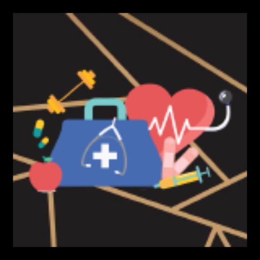
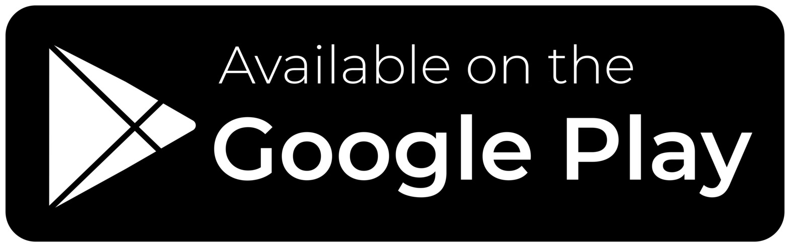
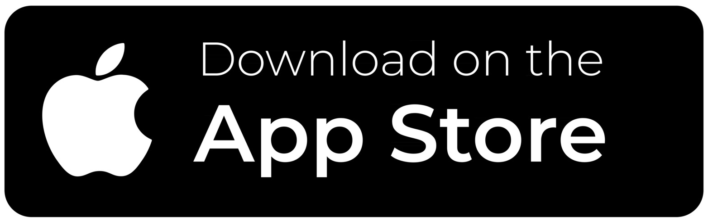

[![Stargazers][stars-shield]][stars-url]
[![Issues][issues-shield]][issues-url]
[![LinkedIn][linkedin-shield]][linkedin-url]

<!-- PROJECT LOGO -->
 

  
  <h3 align="center">Oryx MedMark</h3>
  

    An intelligent assistant that can recognise and scan medicine labels, as well as create reminders and track the amount of medication users have taken so far.
     
    <a href="https://play.google.com/store/apps/details?id=com.davz.medocr"><strong>Visit the Play Store Page »</strong></a>
     
     
    <a href="https://youtube.com">View Demo</a>
    ·
    <a href="https://github.com/BetAlph/Oryx-MedMark/issues">Request Feature / Report Bug</a>
    ·
    <a href="https://github.com/BetAlph/Oryx-MedMark/blob/main/PRIVACY_POLICY.md">Privacy Policy</a>
     
     
    <a href="https://play.google.com/store/apps/details?id=com.davz.medocr">
    
    
  

<!-- TABLE OF CONTENTS -->

  
Table of Contents

  <ol>
    <li>
      <a href="#about-the-project">About The Project</a>
      <ul>
        <li><a href="#built-with">Built With</a></li>
      </ul>
    </li>
    <li><a href="#usage">Usage</a></li>
    <li><a href="#roadmap">Roadmap</a></li>
    <li><a href="#contributing">Contributing</a></li>
    <li><a href="#contact">Contact</a></li>
    <li><a href="#acknowledgments">Acknowledgments</a></li>
  </ol>

<!-- ABOUT THE PROJECT -->
## About The Project

[![Product Name Screen Shot][product-screenshot]](https://example.com)

Here's why:
* Your time should be focused on creating something amazing. A project that solves a problem and helps others
* You shouldn't be doing the same tasks over and over like creating a README from scratch
* You should implement DRY principles to the rest of your life :smile:

### Built With

* [![Flutter]][Flutter-url]

<!-- ROADMAP -->
## Roadmap

- [x] Fix bug with Firebase login SHA256 fingerprint
- [x] Partial internationalization
- [ ] Prevent multiple entries
    - [ ] if possible, medicine clashes or interactions
- [ ] merging the home together with the calendar, such that medicines can be removed from the calendar as well.
- [ ] Exporting information?
- [ ] Full i18n
- [ ] Making sure crucial medication is always taken, like statins. 
- [ ] Gamify, pets or plants?
- [ ] Adding TTS Functionality
- [ ] Fix fetching of FIRST_TIME etc from SharedPrefs
- [ ] Multi-language Support
    - [ ] Chinese
    - [ ] Malay
    - [ ] Tamil
- [ ] Tutorial screens. Use the tutorial_coach_mark package.
- [x] Firebase error catching for phone login
- [x] Proper alarms that work
- [x] ChatGPT API fully up with quotas
- [ ] change or remove the chatgpt option at result screen
- [ ] medicine on irregular days
- [ ] change clipping behavior in listtile of hoomepage to overflow to next line
- [x] Calendar to track patient's meds
- [x] Adding a page to acknowledge taking a medication
- [x] Marking a medication as taken or missed.

See the [open issues](https://github.com/BetAlph/Oryx-MedMark/issues) for a full list of proposed features (and known issues).

<!-- CONTRIBUTING -->
## Contributing

If you have a suggestion that would make this better, please contact me via email or submit an open issue! I'd appreciate any feedback.

<!-- CONTACT -->
## Contact

Dav Zhang - dav.zsy@gmail.com

<!-- ACKNOWLEDGMENTS -->
## Acknowledgments

The following plugins and Flutter packages were used in this.

* [React Icons](https://react-icons.github.io/react-icons/search)

<!-- MARKDOWN LINKS & IMAGES -->
[stars-shield]: https://img.shields.io/github/stars/othneildrew/Best-README-Template.svg?style=for-the-badge
[stars-url]: https://github.com/BetAlph/Oryx-MedMark/stargazers
[issues-shield]: https://img.shields.io/github/issues/othneildrew/Best-README-Template.svg?style=for-the-badge
[issues-url]: https://github.com/BetAlph/Oryx-MedMark/issues
[linkedin-shield]: https://img.shields.io/badge/-LinkedIn-black.svg?style=for-the-badge&logo=linkedin&colorB=555
[linkedin-url]: [https://linkedin.com/in/othneildrew](https://www.linkedin.com/in/dav-zhang/)
[product-screenshot]: images/screenshot.png
[flutter-url]: https://flutter.dev
[![Stargazers][stars-shield]][stars-url]
[![Issues][issues-shield]][issues-url]
[![LinkedIn][linkedin-shield]][linkedin-url]

<!-- PROJECT LOGO -->
 

  
  <h3 align="center">Oryx MedMark</h3>
  

    An intelligent assistant that can recognise and scan medicine labels, as well as create reminders and track the amount of medication users have taken so far.
     
    <a href="https://play.google.com/store/apps/details?id=com.davz.medocr"><strong>Visit the Play Store Page »</strong></a>
     
     
    <a href="https://youtube.com">View Demo</a>
    ·
    <a href="https://github.com/BetAlph/Oryx-MedMark/issues">Request Feature / Report Bug</a>
    ·
    <a href="https://github.com/BetAlph/Oryx-MedMark/blob/main/PRIVACY_POLICY.md">Privacy Policy</a>
     
    <a href="https://play.google.com/store/apps/details?id=com.davz.medocr">
    
    
  

<!-- TABLE OF CONTENTS -->

  
Table of Contents

  <ol>
    <li>
      <a href="#about-the-project">About The Project</a>
      <ul>
        <li><a href="#built-with">Built With</a></li>
      </ul>
    </li>
    <li><a href="#usage">Usage</a></li>
    <li><a href="#roadmap">Roadmap</a></li>
    <li><a href="#contributing">Contributing</a></li>
    <li><a href="#contact">Contact</a></li>
    <li><a href="#acknowledgments">Acknowledgments</a></li>
  </ol>

<!-- ABOUT THE PROJECT -->
## About The Project

[![Product Name Screen Shot][product-screenshot]](https://example.com)

Here's why:
* Your time should be focused on creating something amazing. A project that solves a problem and helps others
* You shouldn't be doing the same tasks over and over like creating a README from scratch
* You should implement DRY principles to the rest of your life :smile:

### Built With

* [![Flutter]][Flutter-url]

<!-- ROADMAP -->
## Roadmap

- [x] Fix bug with Firebase login SHA256 fingerprint
- [x] Partial internationalization
- [ ] Prevent multiple entries
    - [ ] if possible, medicine clashes or interactions
- [ ] merging the home together with the calendar, such that medicines can be removed from the calendar as well.
- [ ] Exporting information?
- [ ] Full i18n
- [ ] Making sure crucial medication is always taken, like statins. 
- [ ] Gamify, pets or plants?
- [ ] Adding TTS Functionality
- [ ] Fix fetching of FIRST_TIME etc from SharedPrefs
- [ ] Multi-language Support
    - [ ] Chinese
    - [ ] Malay
    - [ ] Tamil
- [ ] Tutorial screens. Use the tutorial_coach_mark package.
- [x] Firebase error catching for phone login
- [x] Proper alarms that work
- [x] ChatGPT API fully up with quotas
- [ ] change or remove the chatgpt option at result screen
- [ ] medicine on irregular days
- [ ] change clipping behavior in listtile of hoomepage to overflow to next line
- [x] Calendar to track patient's meds
- [x] Adding a page to acknowledge taking a medication
- [x] Marking a medication as taken or missed.

See the [open issues](https://github.com/BetAlph/Oryx-MedMark/issues) for a full list of proposed features (and known issues).

<!-- CONTRIBUTING -->
## Contributing

If you have a suggestion that would make this better, please contact me via email or submit an open issue! I'd appreciate any feedback.

<!-- CONTACT -->
## Contact

Dav Zhang - dav.zsy@gmail.com

<!-- ACKNOWLEDGMENTS -->
## Acknowledgments

The following plugins and Flutter packages were used in this.

* [React Icons](https://react-icons.github.io/react-icons/search)

<!-- MARKDOWN LINKS & IMAGES -->
[stars-shield]: https://img.shields.io/github/stars/othneildrew/Best-README-Template.svg?style=for-the-badge
[stars-url]: https://github.com/BetAlph/Oryx-MedMark/stargazers
[issues-shield]: https://img.shields.io/github/issues/othneildrew/Best-README-Template.svg?style=for-the-badge
[issues-url]: https://github.com/BetAlph/Oryx-MedMark/issues
[linkedin-shield]: https://img.shields.io/badge/-LinkedIn-black.svg?style=for-the-badge&logo=linkedin&colorB=555
[linkedin-url]: [https://linkedin.com/in/othneildrew](https://www.linkedin.com/in/dav-zhang/)
[product-screenshot]: images/screenshot.png
[flutter-url]: https://flutter.dev
